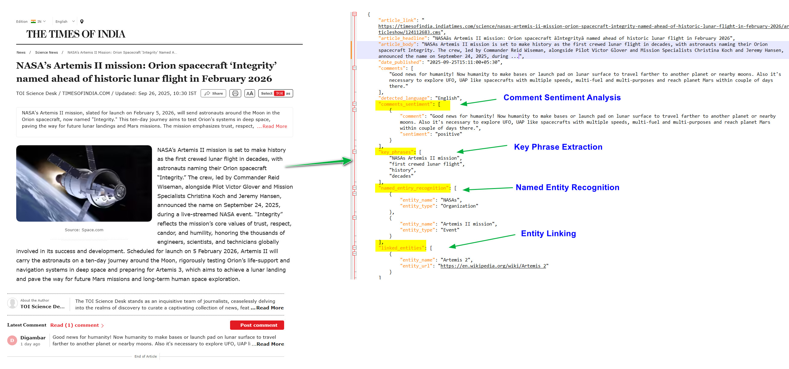

# Time Of India : Text Analytics using Azure AI language Service 
Analysing Time Of India News Articles and Comments using using Azure AI Language Service

## 📊 Project Overview

This mini project fetches articles from **Times of India** feeds, processes them, and applies **text analytics** such as headline extraction, article body parsing, and comment collection.  
It is designed as a foundation for experimenting with **Azure AI Language services**, or further text mining tasks.

---

## 🚀 Features

- Scrapes latest articles from Times of India RSS feeds.  
- Extracts CMS ID, headline, article body, and associated comments.  
- Saves results into structured JSON files for further analysis.  
- Modular Python code that can be extended for text analytics and sentiment analysis.
- Quick Terraform Script for resource creation 

---

## 🖼️ Sample Output

Here’s an example of the processed output:

---

## ⚠️ Disclaimer

This project is for **educational purposes only**.  
You must NOT scrape the Times of India website at a very high frequency. Doing so may result in being blocked.  
You are solely responsible for how you use this code.

## Reference: 

* [AI Language Service](https://microsoftlearning.github.io/mslearn-ai-language/)
